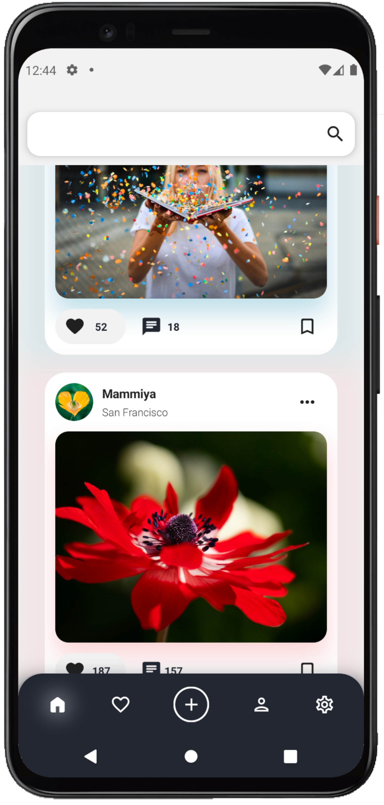
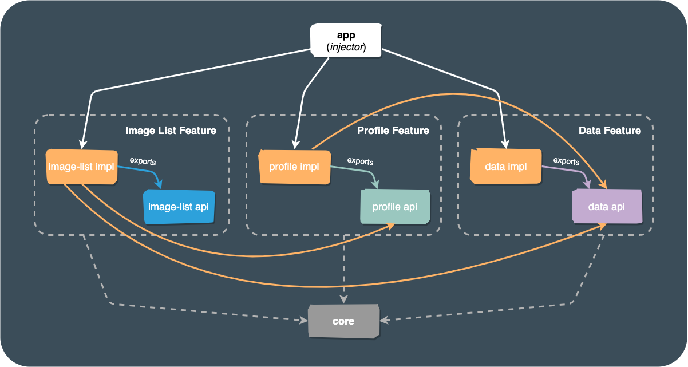

# Android Compose Dagger Sample
Android image browsing application. It uses [Pixabay API](https://pixabay.com/api/docs/) as a backend for the image search feature.

The project is aimed to demonstrate how Airin can migrate to Bazel a multimodule Android Gradle application with the following technologies in use:
- [Jetpack Compose](https://developer.android.com/jetpack/compose) including [Paging 3](https://developer.android.com/jetpack/androidx/releases/paging) and [Navigation](https://developer.android.com/jetpack/compose/navigation).
- [Dagger 2]() with pure interfaces as component dependencies.
- [Room](https://developer.android.com/training/data-storage/room) library. 

<div>
  
</div>

# How to build?

#### Step `1`
Use `Android Studio` to build the application with Gradle or use:
```shell
./gradlew app:assembleDebug
```
#### Step `2`
Migrate the app to Bazel and generate corresponding build scripts:
```shell
./gradlew migrateToBazel
```
#### Step `3`
Build and install the application with Bazel:
```shell
bazelisk mobile-install //app:bin
```

# Where to start?
#### Step `1`
Check the `buildSrc` directory that contains all the migration logic and Starlark templates.
#### Step `2`
Check the root `build.gradle.kts` that contains migration configuration.

# Architecture

<div>
  
</div>

<br>

The app uses a multimodule architecture that splits each **feature** module into 2 parts:
- **api part** - that defines a set of public interfaces that allow other application components to interact with the feature. No specific implementation logic is allowed here.
- **impl part** - that contains all the internal implementation details of the feature. Other features are now aware of this part which means that any update to the application binary interface (ABI) won't force Gradle or Bazel to rebuild all modules that depend on it.

The **app** module is considered as a dependency injector and an entry point to the application. It's main purpose is to build the dependency graph and then route the user to specific application features that are defined in other modules.

In addition, there is a **core** module that contains all the shared code for all other modules.

This sample application contains the following feature modules:
- **image-list** - shows image feed by specific user query.
- **profile** - displays profile details of a specific selected user.
- **data** - provides access to the data layer of the application such as network API and persistence.
